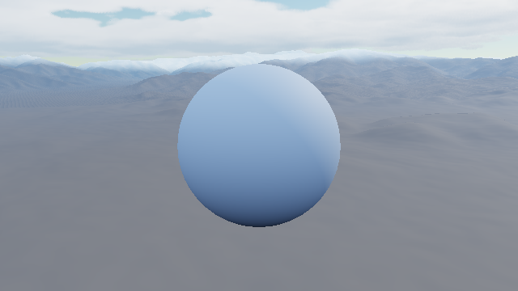
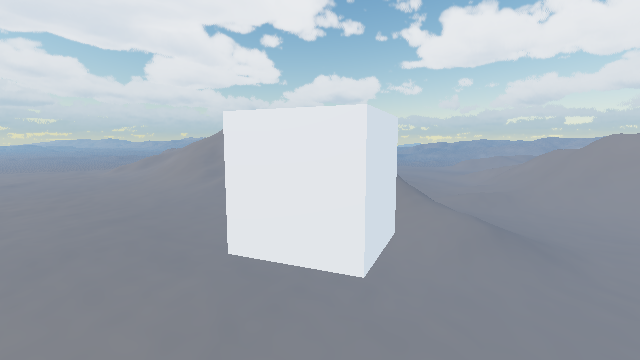

# Terrain Backdrop Foundation Evidence

This compact pack is the retained visual proof for the first shared Terrain V1
foundation milestone. Both captures use the canonical seed-0 Terrain Diffusion
raster, selected placement, a 200 m foreground height, filtered detail, terrain
shadows, and fixed atmosphere lighting. The manifest records the exact elevation
payload hash; generated source data remains outside Git.

The default stride-3 product samples `2,694,289` vertices and retains only the
`385,201` vertices referenced by its `742,368` rendered triangles. The compact
mesh payload is `25,857,260` bytes (24.66 MiB) and uploads through one bounded
transfer submission. These startup metrics are captured in the manifest by the
same command that produces the images.

## Terrain Review Consumer



This frame verifies the isolated review host, continuous cached geometry,
foreground staging, atmosphere lighting, and terrain self-shadowing.

## glTF Proof Consumer



This frame verifies that the opt-in glTF path loads the same validated source,
composes terrain and foreground geometry in one depth domain, and retains the
atmosphere-backed PBR environment. The fallback object keeps the evidence pack
self-contained; no external glTF asset is required.

These images are review evidence, not golden-image tests. Normal CTest smokes
render the same paths at 64x64 with a small tracked analytical fixture and
enforce nonblank image statistics. `manifest.json` records the canonical source
hash, captured revision, compact product and transfer metrics, image hashes,
and validation output.

Regenerate the pack after building the two applications and `cubey_png_stats`
and generating the default terrain asset:

```sh
projects/terrain/capture_foundation_acceptance.sh
```
