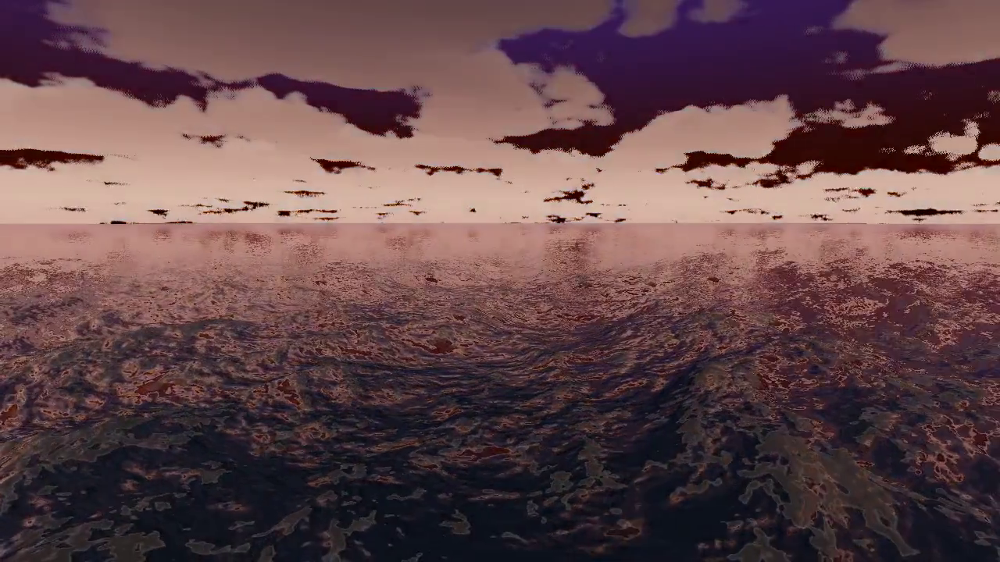
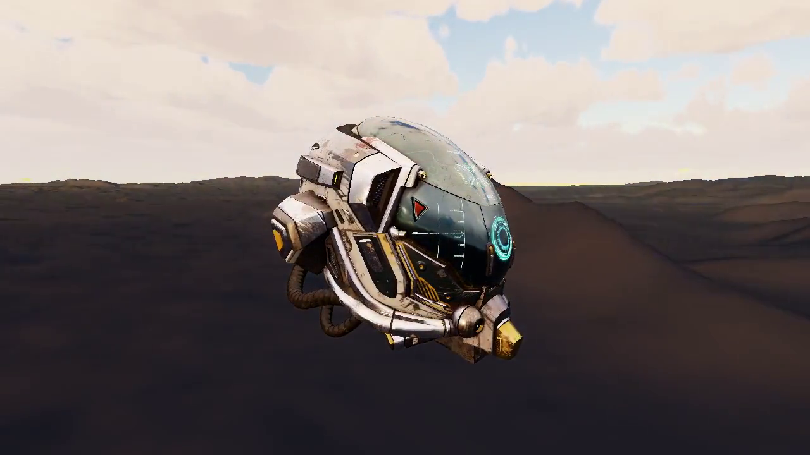
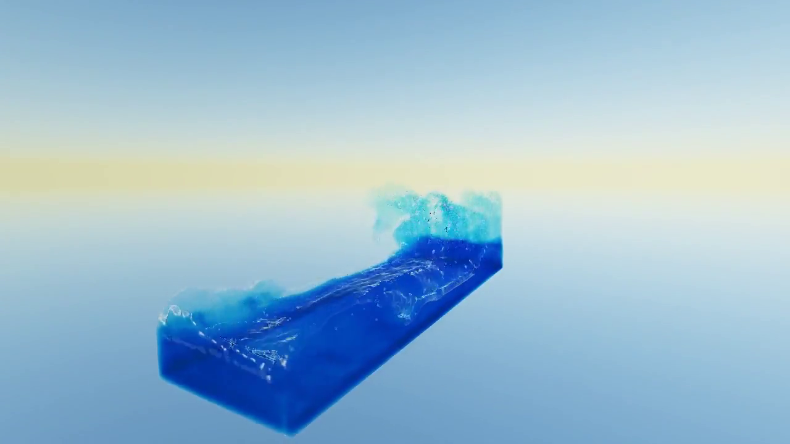
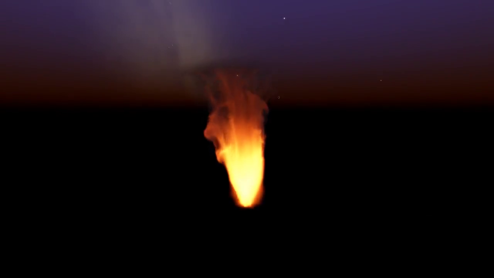

# Cubey showcase media

This directory is the committed media package for the four approved root
highlights, in editorial order: Ocean, glTF + Terrain, Water 3D, and Fire 3D.
Each poster is generated from its corresponding committed MP4. Click a poster
to open the committed MP4 fallback:

| Highlight | Poster / committed MP4 |
| --- | --- |
| Ocean |  |
| glTF + Terrain |  |
| Water 3D |  |
| Fire 3D |  |

The four MP4s are silent, fast-start H.264 High 1280x720 publications at exact
60 FPS. `manifest.json` records the byte hashes, poster timestamps, capture
recipes, source revisions, capture-time dirty-diff provenance, and licensing.

The higher-quality capture masters and audition comparisons remain ignored
under `outputs/showcase/audition-2/`; they are not copied into this package.
There is no merged hero reel.

GitHub native inline players are a later publication step. After the exact
committed bytes have been pushed, each matching MP4 may be uploaded through
GitHub's Markdown attachment flow and its resulting native-player attachment
URL may be added alongside the committed relative link. No attachment URLs
are recorded here until those exact bytes have been pushed and uploaded.

Cubey source and the Ocean, Water 3D, and Fire 3D generated media are MIT
licensed. The glTF + Terrain MP4 and poster incorporate the Khronos Damaged
Helmet asset and are a media-only `CC-BY-NC-4.0` exception. They must be
attributed to ctxwing (2018 rebuild/conversion) and theblueturtle_ (2016
earlier model); see the upstream
[Damaged Helmet source](https://github.com/KhronosGroup/glTF-Sample-Assets/tree/main/Models/DamagedHelmet).
This exception does not relicense Cubey source, and the glTF media is not
permissively reusable.
